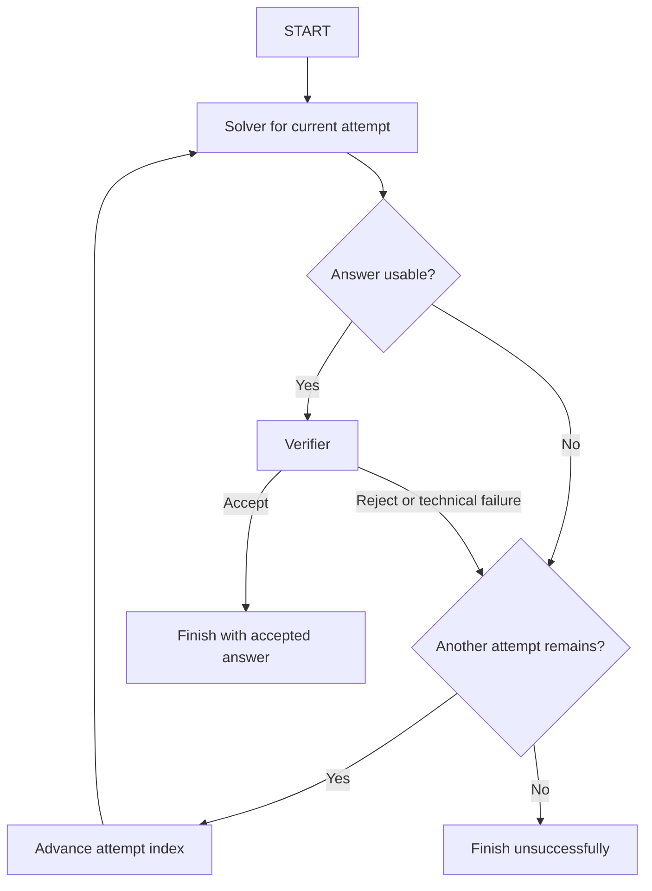

# Solver-verifier workflow implementation and experiment plan

Created: 2026-10-06. Updated: 2026-10-08. Status: Milestones 1–3 completed,
with a user-selected provisional verifier and a successful live integration pilot.
Milestone 4 remains. This document alone does not authorize paid calls.

Latest October 8 checkpoint: the approved routed comparison
[stopped](solver-verifier-routed-development-results.md) after 223 requests,
$0.0284535204 reported spend, 59 graded executions and two complete question
blocks. No new unknown charges or full ranking. A fully billed 512-token solver
truncation was classified as a global gateway failure under the frozen v4
policy; the spend cap was not exhausted. A separate option/key inconsistency in
`mathqa_test_0187` is flagged without changing the selected dataset.

The [opt-in v5 amendment](solver-verifier-routed-development-v5-proposal.md)
now counts reconciled solver length truncation as one unusable mathematical
attempt, preserving its cost and the three-slot limit. Other gateway/billing/
identity/usage/price failures still stop. All 174 offline tests pass; old policies
and records remain intact, with no new migration or dependency. A fresh run of
the same 540 executions is prepared at the same $0.48995280 estimate, $4.25 cap
and 3,240-request maximum. It requires fresh approval; no paid rerun occurred.

Earlier October 8 preparation: the user requested the
[routed development comparison](solver-verifier-routed-development-proposal.md).
The final frozen plan retains twenty original questions, all twenty-seven
sequences, one repetition and the fixed Gemini verifier: 540 executions,
$0.48995280 estimated new cost, $3.75507954 conservative reservations, proposed
$4.25 cap and 3,240 maximum gateway HTTP requests. Known compatible DeepSeek
providers can return after temporary inactivity, within unchanged routing
price/parameter controls. All 166 offline tests and preparation audits pass.
Preparation consumed no credits; this run was subsequently approved and stopped
as recorded above.

October 8 checkpoint: after pinned DeepSeek development runs and bounded
cooldown recovery encountered upstream throttling, the user chose to keep
DeepSeek and authorize an opt-in routing implementation. The
[automatic routing proposal](solver-verifier-routing-proposal.md) records the
fixed price ceilings, provider/cost audits, offline validation, and the next
six-execution diagnostic. It proposes $0.0079968 estimated spend, a $0.07 cap,
and 36 maximum gateway HTTP requests, with zero client network retries.
Paid approval is pending. Milestone 4 remains open; provider variability is
reported under a frozen routing policy and does not change the 27 model triples.

The user subsequently approved the routed check. It
[completed](solver-verifier-routing-results.md): six executions, fourteen
requests, $0.00199989274 reported cost and no newly unknown charges. All final
options match their independent keys. One live mathematical retry recovered
after an assistant-reviewed false rejection. Provider/usage/spending/grade
audits pass and historical rows remain intact. Keep the routed DeepSeek model
and fixed provisional Gemini verifier; a broad development comparison requires
a separate frozen plan, advance cost notice and approval. Milestone 4 stays open.

This plan records the design agreed in the October 5-6 discussion. It covers choosing a verifier, implementing a bounded retry workflow, and evaluating solver sequences. It complements the broader [project description](../PROJECT.md) and [decision log](decision-log.md). Suggested settings and sample sizes below are proposals, not measured results or already agreed experimental choices.

## Objective and scope

Build a workflow that answers a MathQA question, checks the solver's reasoning and selected option, and retries with a fresh solver request when the answer is rejected. Find a reliable, affordable verifier first, then compare ordered solver sequences for accuracy, cost, and latency.

With three solver models and two retries, there are three attempt positions and `3^3 = 27` ordered configurations. Repeated models are allowed. A single graph executes every configuration; the selected sequence is input data, rather than a separately implemented graph.

The initial deliverable is a trustworthy measurement system and a working loop. Adaptive search, shared-prefix reuse, Matrix UCB-E, random-search comparisons, verifier ensembles, and training a custom verifier belong to later research milestones. Exhaustive evaluation of 27 sequences supplies a reference for that work.

## Agreed workflow and evaluation rules

1. Each execution has at most three solver attempts: one initial attempt and two retries.
2. Each solver request receives the original question and choices through the frozen solver prompt. It receives no previous answer, verifier verdict, explanation, or indication that it is retrying.
3. Solver sampling uses a small non-zero temperature. The exact value remains to be frozen; `0.2` is the proposed starting setting for the new workflow profiles.
4. The verifier receives the question, choices, solver calculation, selected option, and returned value. It accepts only when the reasoning supports the answer and the selected option is correct.
5. Runtime requests exclude the MathQA answer key, dataset rationale, and annotated formulas. Those are available only to independent offline grading/review.
6. Local checks reject only unusable answers. Existing strict format validity is a diagnostic, not the new workflow's acceptance gate.
7. A usable answer goes to the verifier. Acceptance stops execution immediately. Rejection advances to the next configured solver, if an attempt remains.
8. If all three attempts are rejected, the execution scores zero, even if a rejected answer happens to match the answer key. There is no fallback to a previously rejected answer.
9. Verifier approval is distinct from measured correctness. The primary workflow score is `1` only if execution ended with an accepted answer whose option matches the offline answer key; otherwise it is `0` for a finished execution.
10. Correct reasoning is required by the runtime acceptance contract. Independent reasoning validity is measured separately where reviewed labels exist. An accepted correct option with invalid reasoning can score `1` on answer accuracy while still being a verifier error on the reasoning contract; it must not be reported as fully verified correct.

Changing prompts, reasoning budgets, sampling, providers, parsing rules, or the verifier creates a new configuration snapshot. Historical settings and observations stay intact.

## Current foundation

- `scripts/mathqa_solver.py` already uses LangGraph for `START -> solver -> END`.
- `scripts/mathqa_batch.py` records requests, responses, usage, costs, timings, errors, and format validation in `results/mathqa_runs.sqlite3`.
- `scripts/mathqa_grading.py` supplies independent answer-only grading. Its calculation-format checks do not establish reasoning correctness.
- `scripts/mathqa_models.py` defines three existing solver profiles: Qwen2.5 7B, Qwen3 32B, and DeepSeek V3.2. Their current temperatures are 0, 0.7, and 0 respectively. New workflow profiles should make the proposed sampling change explicit without silently changing existing batch defaults.
- The [batch notes](mathqa-batch-experiment.md#authorized-live-batch-first-100-questions-2026-10-05) record run `6e8ba4fd-3f6d-41f9-9522-23c84e0d332d`: 300 solver calls on the first 100 subset questions, including failures. This is a source of saved answers for verifier screening, not a baseline measured under the proposed new sampling settings.
- The current call uniqueness rule does not distinguish different solver configurations executing the same model at the same attempt position. New workflow storage therefore needs explicit configuration and execution identities.

## Runtime design: LangGraph

Use LangGraph `StateGraph` with solver, usability-check, verifier, and routing steps:

The graph state holds the execution ID, original question/choices, frozen configuration, attempt index, current parsed answer, verdict/status, and terminal outcome. Recorded history remains accessible for measurement but is never passed wholesale to a solver. The solver request builder selects only the original solver inputs.

SQLite is the experiment record. LangGraph checkpointing/resumption is not required for the first version; an interrupted execution remains explicitly interrupted. Persist call initiation before sending the request and the outcome after it returns, so partial experiments remain inspectable.

### Usability and error policy

Proposed initial usability contract:

- Require an unambiguous option in `a`-`e` and a nonempty calculation that can be extracted safely from a complete response.
- Preserve the original reply and report parsing diagnostics. A longer calculation, prose, cosmetic markup, or a mismatch with the old 160-character calculation rule does not alone make an answer unusable.
- Do not infer a missing option from its value, choose between conflicting final options, or silently repair ambiguous output. Verifier inputs include the original selected fields and choices; an option/value inconsistency is a mathematical verification issue when the fields remain usable.
- Empty, truncated, or unparseable solver generations are unusable. Skip the paid verifier call for them and record why.
- Freeze the precise extraction rules before live testing. Keep them independent from the legacy formatting validator and test readable legacy format-invalid examples.

Proposed technical-failure policy, to freeze with implementation:

- A solver request failure consumes its solver attempt slot. A verifier request failure or invalid verdict does not count as mathematical rejection, but cannot authorize acceptance; advance to the next solver attempt.
- No hidden HTTP/client retries or automatic provider fallbacks. Any later transport-retry policy must be explicit, separately counted, and included in cost.
- Verifier output is exactly a parsed Boolean decision, such as `{"accepted": true}`. Missing/invalid output is a distinct state, not `false` masquerading as a valid verdict.
- User cancellation, exhausted experiment budget, and unexpected application errors stop scheduling and mark unfinished work interrupted or budget-stopped. They do not become evidence that all three attempts were mathematically rejected.
- A budget/infrastructure stop leaves the aggregate experiment incomplete. Do not claim a completed accuracy comparison until every planned execution has a terminal outcome or explicitly report partial coverage.

## Storage and migrations

Keep SQLite and Python's existing SQLite interface. Add workflow tables to the existing database while preserving existing batch tables and their export/grading behavior. Alembic and SQLAlchemy are not needed for this first implementation.

| Table | Meaning and essential contents |
| --- | --- |
| `workflow_runs` | Experiment kind (`verifier_screen` or `sequence_evaluation`), selected questions/split, dataset checksum, code version/dirty state, repetition policy, budget, timestamps, and status. |
| `workflow_configs` | Run/configuration identity, ordered solver profile snapshots, verifier snapshot, prompts/contracts, sampling/reasoning limits, providers, and retry/error policies. A screen may have only a verifier profile and a saved-answer source. |
| `workflow_executions` | One configuration/question/repetition: execution ID, status, accepted attempt reference, terminal reason, and wall-clock duration. |
| `workflow_attempts` | One reached solver slot: execution ID, position 1-3, new solver-call or historical solver-call reference, extracted fields, usability diagnostics, verifier-call reference, and verdict/status. |
| `workflow_calls` | One actual new API request, with solver/verifier role, requested/returned model and provider, credential-free request/response, usage including reasoning tokens, cost, timing, finish reason, and errors. |
| `workflow_grades` | Independent versioned execution/attempt grades: option correctness, optional reasoning-validity label, label source/reviewer, dataset checksum, diagnostics, and timestamp. Unknown reasoning validity stays unknown. |
| `schema_migrations` | Applied numbered migration versions and checksums/timestamps. |

Implementation constraints:

- Uniquely identify an execution by run, configuration, question, and repetition. Uniquely identify a solver slot by execution and attempt position.
- Link each verifier call to the exact solver answer it judged. Screening references historical solver calls without duplicating them as newly paid calls.
- Distinguish accept, reject, verifier error/invalid output, and verification not requested. Keep generation, usability, verification, and grading as separate facts.
- Preserve missing cost/usage as `NULL`, not zero. Report known-cost totals and unknown-cost counts.
- Screening totals include only new screening calls. Historical solver generation cost is separate provenance, not an expense incurred again by screening.
- Store original responses and frozen settings. Exclude API keys and authorization headers; sanitize error details.
- Keep writes short, enable foreign keys on every connection, and use transactions for related state changes. Do not hold a transaction open during an HTTP request.
- Derive configuration summaries from execution/attempt/call records initially. Shared-call reuse is deferred so per-execution costs remain straightforward.
- Use numbered SQL migrations, verify version/checksum, and test both a fresh database and an upgrade preserving existing rows. Back up the existing database before its first schema upgrade.

## Milestone 1: storage and offline verifier-screening preparation

Deliverables:

- Numbered migrations, workflow storage helpers, and configuration snapshots.
- A verifier-screen preview that selects saved answers and prints proposed calls/settings without making requests or modifying experimental observations.
- A small independent reasoning-review fixture with traceable labels.

Proposed initial source: the first 20 questions of the recorded 100-question batch, giving 60 source attempts across the three solvers. Unusable/failed source attempts are retained in coverage diagnostics but do not incur verifier requests.

Review examples covering valid reasoning/correct option, wrong option, correct option/invalid reasoning, correct arithmetic/wrong problem interpretation, valid shortcuts, and unusable output. Controlled corruptions can be included as separate diagnostic cases; preserve their provenance and do not mix them into natural-answer prevalence estimates. Reviewers must not label reasoning solely from the option key or the candidate verifier's decision. Ambiguous dataset cases receive an uncertain label rather than forced mathematical truth.

Completion criteria:

- Existing batch records, commands, and summaries remain readable and unchanged.
- Preview reports source coverage, candidates, prompts/settings, and an upper bound on request count.
- Reviewed labels are independent of candidate verdicts, with reasoning-validity unknown where review is incomplete.
- Offline storage/parsing tests pass; no paid calls are needed for this milestone.

## Milestone 2: verifier experiment and selection

Initial shortlist from the discussion, pending a fresh availability/provider/control check:

| Candidate | Proposed screening role/settings |
| --- | --- |
| `google/gemini-2.5-flash-lite` | Low-cost candidate with thinking disabled where supported. |
| `google/gemini-3.1-flash-lite` | Candidate with minimal thinking effort. |
| `deepseek/deepseek-v3.2` | Existing-model comparison with explicit provider and reasoning settings. |

These are hypotheses, not a claim that any candidate is sufficiently reliable. Use the same verification prompt and answer set; treat different reasoning settings as distinct candidate profiles. Verify current prices, supported settings, token limits, structured output support, and actual returned provider before the live test.

Verifier prompt checks the problem interpretation, mathematical steps, arithmetic, and option mapping. It requests a Boolean verdict without returning feedback to the solver. Low/deterministic verifier sampling is proposed for consistency. Reasoning/output limits must leave room for a verdict; a short visible response is not assumed to mean low billed usage.

Measurements:

- Wrong-option acceptance rate: accepted answers among independently key-wrong usable answers.
- Reasoning-contract false acceptance: accepted answers among reviewed invalid-reasoning answers, including correct-option cases.
- Contract false rejection: rejected answers among reviewed valid-reasoning, correct-option answers.
- Acceptance rate, usable-source coverage, verifier error/invalid-output rate, and repeated-verdict disagreement on a diagnostic subset.
- Per-call and total reported cost, reasoning tokens, elapsed time, and breakdowns by originating solver and question type.
- Numerators, denominators, and uncertainty, not only percentages. Unknown reasoning labels are excluded from reasoning-contract denominators and reported explicitly.

With at most 60 usable source answers and three candidates, the initial natural-answer screen makes at most 180 verifier requests. Reviewed extra cases and repeat checks add separately declared requests. This is screening evidence, not sufficient proof of negligible verifier errors.

Selection: prioritize low false acceptance while preserving acceptance of valid solutions, then compare cost and latency. Expand testing of promising candidates using more saved development answers before freezing a winner. If no candidate meets the agreed reliability target, revise the prompt/settings or shortlist rather than assuming one is adequate. Reusing development examples is allowed; final held-out questions must remain outside selection.

Completion criteria:

- A reproducible comparison with reviewed failures, coverage, error counts, cost, and uncertainty.
- Explicit reliability targets and a winning frozen verifier profile, or a documented reason to continue screening.
- No configuration ranking uses a changing verifier.

## Milestone 3: implement and demonstrate the LangGraph loop

Build the graph and a preview-first runner with at most three attempts. Implement independent final-option grading outside the graph. Add explicit small non-zero solver sampling profiles for this workflow, leaving existing defaults intact.

Offline checks must demonstrate:

- Immediate acceptance makes one solver call and one verifier call.
- Recovery at attempt two or three selects the correct next model.
- Three rejections stop with score zero and no fourth solver call.
- An unusable solver response skips verification but retains the slot and failure evidence.
- Technical failures and invalid verifier responses remain distinguishable from mathematical rejection.
- A correct but rejected answer cannot rescue an exhausted execution's score.
- An accepted wrong answer stops the graph but receives offline score zero.
- Every solver request contains the original solver input only; answer keys, prior answers, and verifier feedback never enter runtime requests.
- Early termination produces no calls for unreached slots; all reached calls retain cost/timing/error evidence.

Then run a separately budgeted small live pilot using the frozen verifier. Natural cases may not exercise every route; offline controlled cases prove the boundary behavior. Freeze the exact solver prompt, token budget, temperature, provider controls, extraction policy, and error policy before sequence evaluation. The existing 256-token limits have caused truncation, so do not assume they are adequate without the pilot.

Completion criteria: passing offline checks and inspectable live execution traces demonstrating the actual solver/verifier integration, with final scores, cumulative costs, and wall-clock latency agreeing with stored events.

## Milestone 4: evaluate the 27 solver configurations

- Generate all ordered triples from the three solver profiles, including repetitions.
- Hold verifier, solver profiles, parsing, and retry policy fixed. Evaluate every sequence on the same question set with the same repetition count.
- Compare against each solver used once under the same new solver sampling settings. A diagnostic one-attempt solver-plus-verifier baseline can also show what retries contribute.
- Count one evaluation as one full configuration/question execution. Also report solver attempts and actual API request counts separately.
- Balance/randomize execution order with a recorded scheduling seed to reduce provider/time-of-day confounding. Do not assume an API seed guarantees reproducibility.
- Report average answer-key accuracy over all planned completed executions, accepted-answer coverage, cost per question including failed calls, wall-clock latency, attempt counts, repeated-answer frequency, and recovery after rejection. Reasoning-audit quality remains a separate labeled measure.
- Compare configurations using paired question-level results. Treat repetitions of one question as grouped observations when estimating uncertainty; do not count them as unrelated questions.
- Choose configurations on development questions using an explicit objective, such as highest accuracy under a deployment-cost limit. Report accuracy/cost tradeoffs when no single objective is settled.

Proposed staging: start with 20 development questions and three repetitions per sequence, expanding only if uncertainty and budget justify it. The upper bound on new calls is `6 * 27 * question_count * repetitions` (three solvers plus three verifiers per execution); for 20 questions and three repetitions that is 9,720 calls. Early acceptance and unusable solver output reduce this number. This larger stage must be costed before execution; it is not the initial verifier pilot.

Proposed split: use the existing first 100 subset questions as development material and reserve the remaining 100 for held-out evaluation, after checking saved-run history for prior exposure. Save exact question IDs and the dataset checksum. Do not describe development examples already used for screening as held-out. Evaluate only prespecified finalists on held-out material and do not retune from those results.

Completion criteria: complete comparable development results, a declared selection rule, and a separate held-out evaluation with reported uncertainty. Call the exhaustive reference the best sequence on the evaluated set, not a universally best sequence.

## Budget and execution controls

The [first development stage](solver-verifier-development-proposal.md) is now
prepared as a smaller initial comparison: twenty sampled development questions,
one repetition of each sequence, 540 executions. The earlier three-repetition
suggestion remains a possible expansion, not the initial scope. First-slot
observations supply matching baselines with no extra paid batch. Estimated
$0.39651192, full-cap reservations $3.12607080, proposed cap $3.50 / 3,240
requests. Balanced plans, exposure checks, guarded execution and paired reports
were implemented with numeric paid approval pending at preparation. Milestone 4 remains open.

The user approved that scope on October 8. The [attempted evaluation](solver-verifier-development-results.md)
stopped after 45 requests at a DeepInfra 429 with unknown billing, before any
question completed all 27 sequences. Fourteen executions have final scores;
one is incomplete. Known spend $0.00555908 plus one unreported charge. The
partial-report exporter is repaired, all 133 offline tests pass, and prior
records remain intact. No ranking or automatic continuation; resolve provider
capacity and propose a new frozen/costed stage before another paid run.

The user then approved the [Venice provider stage](solver-verifier-venice-proposal.md).
Its [run stopped](solver-verifier-venice-results.md) after 29 requests at another
upstream 429 with unknown billing: ten finished executions, one incomplete,
known additional spend $0.00379209782 plus one unresolved charge. No complete
question block or ranking. All 136 offline tests passed and audit checks hold.
Next design explicit rate-limit handling and billing safeguards, then propose
a bounded availability diagnostic before another full evaluation. No automatic
rerun or settings change is authorized.

Following the user's request, [bounded 429 recovery](solver-verifier-availability-proposal.md)
is implemented offline with separate physical-call storage and budget accounting.
An explicit opt-in policy allows only the pinned provider's empty upstream 429,
with at most two extra HTTP requests per run, 30/60-second backoff, and a $0.002
held-reservation allowance for at most two unreported charges. Mathematical
solver attempts remain limited to three. A six-execution availability check is
prepared at approximately $0.0049 expected / $0.05 cap / 38 maximum requests,
awaiting its paid approval. Offline validation and migration rehearsal pass;
Milestone 4 remains open and no broad rerun is authorized automatically.

The user approved this check and its explicit billing exception. The
[availability results](solver-verifier-availability-results.md) record seven
physical requests, two finished executions, one incomplete, and three consecutive
DeepSeek 429s after 30/60-second cooldowns. Known new spend $0.00055315773, three
unresolved charges and $0.00120554892 authorized holds. Live transport/slot
separation and budget guards pass independent audit; the key cap is not exhausted.
Prepare a replacement third solver as the recommended next checkpoint, keeping
Gemini fixed and disclosing a new live scope/cost before more paid calls.

- Standing user instruction: before every credit-consuming OpenRouter workflow/script, explain its purpose, proposed scope, estimated total cost, and a small cost breakdown. This applies to live diagnostics/tests, trials, batches, reruns, and retries as well as the main workflow. Follow the [repository spending rule](../README.md#openrouter-spending-rule).
- The advance breakdown includes models/providers and roles, expected/maximum request counts, input-token and total billed output-token assumptions (including reasoning), current rates, and subtotals. Separate the expected estimate from the spending limit and disclose uncertainty. Reuse saved responses/offline checks where they suffice. Run only within existing user authorization; expansion beyond it needs authorization before execution. Report actual known spend and unknown measurements afterward.
- Planning, previews, migrations/tests on disposable databases, and offline grading make no model calls.
- Paid runners require an explicit execution option. A numeric budget and maximum request count must be configured before a live stage. This plan does not set or authorize a spend amount.
- Quote a cost estimate from current pinned-provider rates and plausible measured token usage. Record assumptions; do not present an estimate as guaranteed spend.
- Before scheduling another request, consider recorded spending plus conservative reservations for in-flight requests. Stop scheduling if the cap could be exceeded. Unknown usage/cost requires reconciliation or stopping, rather than being counted as free.
- Use bounded concurrency with durable per-call outcomes. Record actual reported usage/cost and any difference from estimates.
- Track verifier-selection expense, configuration-profiling expense, and finalist deployment/held-out expense separately. Also keep workflow wall time separate from sums of overlapping request durations.

## Planned file changes

Names are proposed implementation boundaries, not files already implemented.

| New file(s) | Responsibility |
| --- | --- |
| `notes/solver-verifier-plan.md` | This plan and milestone status. |
| `scripts/mathqa_workflow_store.py` | Workflow schema/migrations, snapshots, and records. |
| `scripts/migrations/NNN_*.sql` | Numbered schema changes. |
| `scripts/mathqa_verifier.py` | Verifier profiles/prompt, request construction, and verdict parsing. |
| `scripts/mathqa_verifier_trials.py` | Read-only saved-answer screening previews. |
| `scripts/mathqa_verifier_preflight.py`, `scripts/mathqa_verifier_screen.py` | Free metadata/cost preflight, frozen screening plans, explicitly budgeted execution, and comparisons. |
| `scripts/mathqa_workflow.py` | LangGraph nodes/routing and workflow CLI. |
| `scripts/mathqa_workflow_grading.py` | Independent execution scores and workflow summaries. |
| `tests/test_mathqa_workflow*.py`, `tests/test_mathqa_verifier*.py` | Meaningful routing, leakage, parsing, migration, and measurement checks. |
| `data/verifier_review/` | Small versioned reviewed cases and label provenance; raw experiment outputs remain under ignored `results/`. |

Likely existing-file edits:

- `scripts/mathqa_models.py`: expose workflow-specific profile snapshots/sampling without changing legacy batch behavior.
- Shared HTTP, parsing, and grading helpers: extract/reuse narrowly where needed rather than duplicating request behavior. Preserve legacy response-contract semantics.
- `README.md`: link this plan now; document implemented commands later.
- `notes/decision-log.md`: link the current plan and distinguish settled rules from remaining choices.

No dependency change is expected initially: LangGraph, httpx, dotenv, and built-in SQLite are already available. A separate client/server database, ORM, tracing service, and graph checkpoint database are not prerequisites.

## Decisions still to freeze before their dependent live stage

- Fresh live-stage controls/pricing preflight for the fixed provisional verifier `flashlite25__reasoning`.
- Solver temperature (proposed `0.2`), retained/changed sampling controls, prompt, and adequate output limits.
- Precise usability extraction and technical-failure policy.
- Reviewed reasoning labels, reliability targets, treatment of ambiguous/noisy MathQA annotations, and the size of verifier expansion/repeat checks.
- Numeric spend/request caps for screening, live loop pilot, development sweep, and held-out evaluation.
- Exact development/held-out IDs, repetition counts, finalist selection rule, and uncertainty reporting.

These are implementation/experiment choices to resolve at the relevant milestone, not reasons to delay creating this plan. Implementation can progress offline while live-stage budget and settings are being finalized.

## Progress checklist

- [x] Record agreed rules and explicit implementation/experiment plan.
- [x] Milestone 1: storage, offline screening preview, and reviewed fixtures (2026-10-06; 53 offline tests passed, zero OpenRouter requests).
- [x] Milestone 2: run budgeted verifier experiments and choose Gemini 2.5 Flash-Lite with reasoning provisionally (user choice, 2026-10-07).
- [x] Milestone 3: implement/test the loop and finish a small live pilot (2026-10-07; 123 offline tests, six live executions, $0.00249524).
- [ ] Milestone 4: evaluate sequences and held-out finalists.

Milestone 1 was committed as `c25aa92` on 2026-10-07. [Milestone 2 offline
preparation](solver-verifier-milestone-2-preparation.md) is complete: public provider
metadata, 22 reviewed natural outputs, a frozen 36-call pilot proposal, guarded
screening execution, and 71 passing offline tests. The user approved the 36-call
pilot with a $0.05 limit; [it completed](solver-verifier-pilot-results.md) costing
$0.00163967, with no missing costs or technical errors. Every candidate accepted
one incorrect natural solution, so none is selected. The 195-call full screen
and verifier selection remain later work in Milestone 2, pending a new budget
proposal and authorization for any follow-up paid run.

The [recomputation comparison](solver-verifier-comparison-proposal.md) is now
prepared offline with 82 passing tests: three variants per model, eight
reviewed questions, nine reused baseline verdicts, and 189 proposed new calls.
Estimated new cost is $0.04831528, with $0.24849207 in conservative reservations.
The user approved the $0.25 limit; the run stopped after five new calls costing
$0.00136376 when DeepSeek's reasoning profile truncated and reported
inconsistent token counts. The [partial results](solver-verifier-comparison-results.md)
record the billing/storage audit and proposed next checkpoint. None of the
expansion questions was reached, so no verifier can be selected. A revised
comparison and new advance cost notice are needed before further paid calls.
The [amended comparison](solver-verifier-comparison-amended-proposal.md) is now
prepared offline: eight profiles, thirteen reused verdicts, 163 new requests,
estimated cost $0.03962351, conservative reservations $0.21356408, proposed cap
$0.22 was approved. The [amended run](solver-verifier-comparison-amended-results.md)
stopped after forty new calls costing $0.00483675, when DeepSeek recompute
truncated without a Boolean verdict. All 89 offline tests passed before
execution; the post-run audit passes and legacy records are unchanged. Total
known verifier-selection spend is $0.00784018. Every tested profile has observed
false acceptances. The user then chose to proceed with Gemini 2.5 Flash-Lite
using recomputation plus reasoning, deferring additional verifier experiments.
This provisional selection concludes Milestone 2; it does not remove the
recorded mistakes or turn acceptance into independent correctness.

The [offline part of Milestone 3](solver-verifier-milestone-3-offline.md) is
implemented: one bounded LangGraph for all 27 triples, durable calls, original
input-only retries, usability/error routing, serial run-wide spend gates, and
atomic independent option grading. All 112 offline tests pass. A saved
controlled demo exercises acceptance at the first/third slot, exhaustion,
and an accepted wrong option; it uses sixteen mock calls and zero OpenRouter
requests. The real experiment database remains unchanged. Next prepare a small
live loop pilot with fresh endpoint preflight, a frozen numeric budget/request
cap, an HTTP adapter, and advance cost disclosure. Milestone 3 stays open until
that approved live integration is demonstrated.

The user subsequently instructed us to commit and run the pilot. The
implementation checkpoint `0fc1d05` and guarded adapter/proposal checkpoint
`00453de` were committed first. The [live pilot](solver-verifier-loop-pilot-results.md)
completed all six executions with twenty calls, $0.00249524 cost, no unknown
charges or technical errors. Natural decisions reached all three positions;
six accepted final options match the independent keys. A separate assistant
reasoning review confirms valid accepted calculations and invalid rejected
calculations in this small sample. Read-only audits pass; legacy and prior
workflow records are unchanged. Milestone 3 is complete. Next prepare Milestone
4's balanced development sweep with fresh rates and a separate advance cost
proposal; no larger paid run is authorized by completing this pilot.

Reference documentation consulted during design: [LangGraph workflows](https://docs.langchain.com/oss/python/langgraph/workflows-agents), [SQLite use cases](https://www.sqlite.org/whentouse.html), [Alembic](https://alembic.sqlalchemy.org/en/latest/), and [OpenRouter reasoning-token controls](https://openrouter.ai/docs/guides/best-practices/reasoning-tokens). Availability, prices, and provider support must be rechecked at live execution time.
